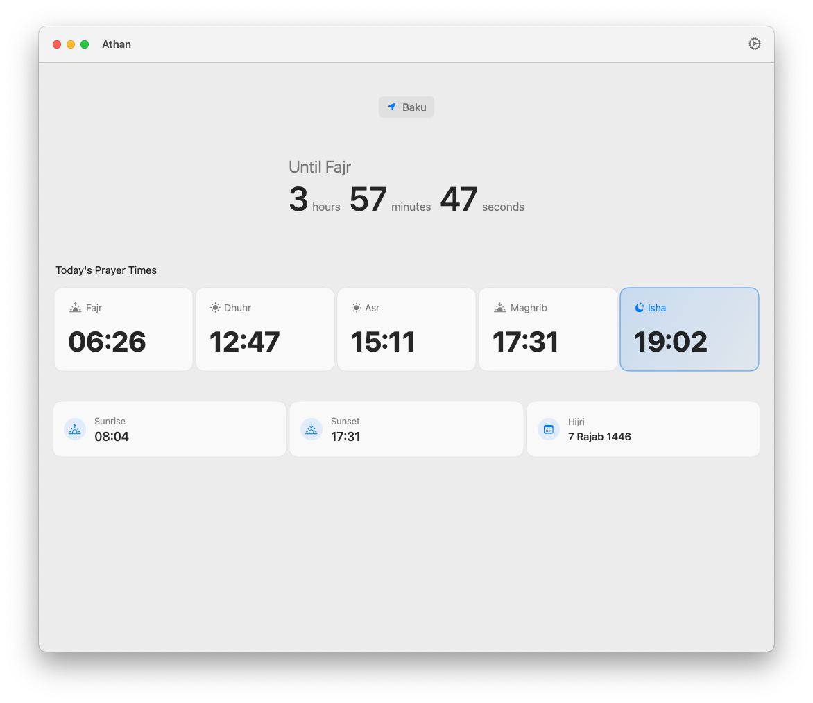
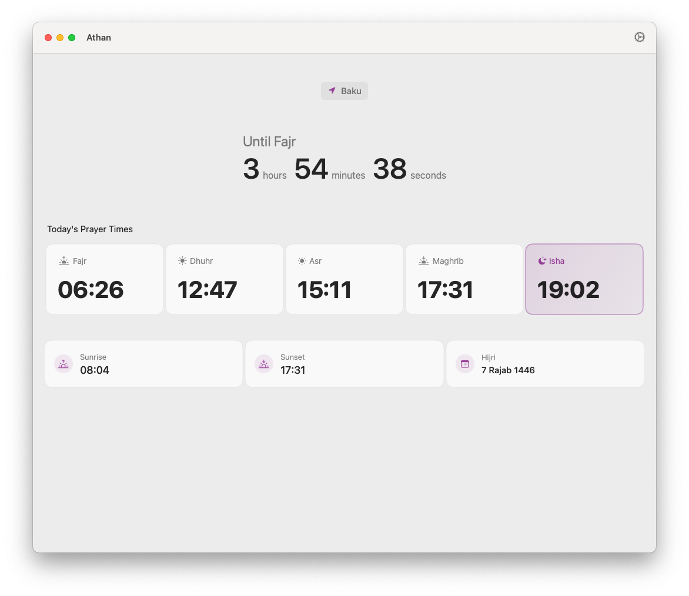
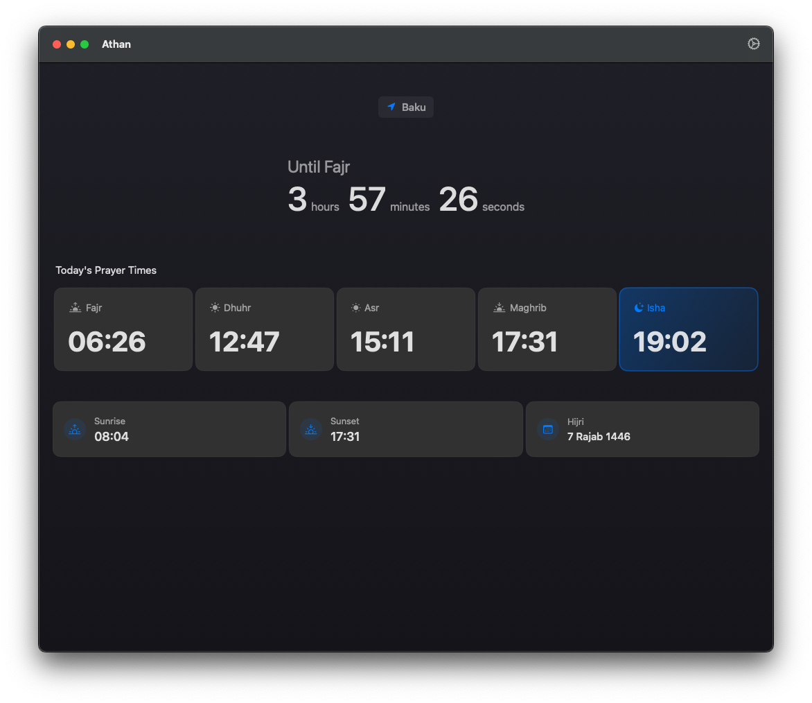
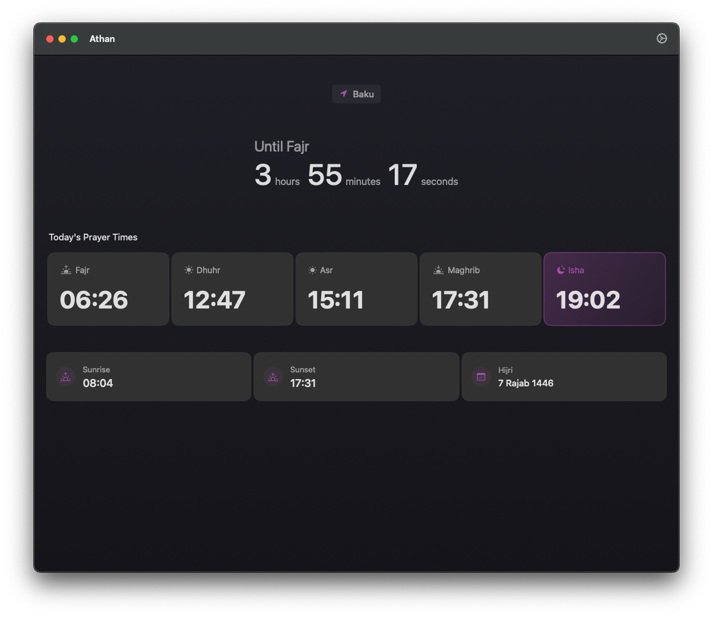
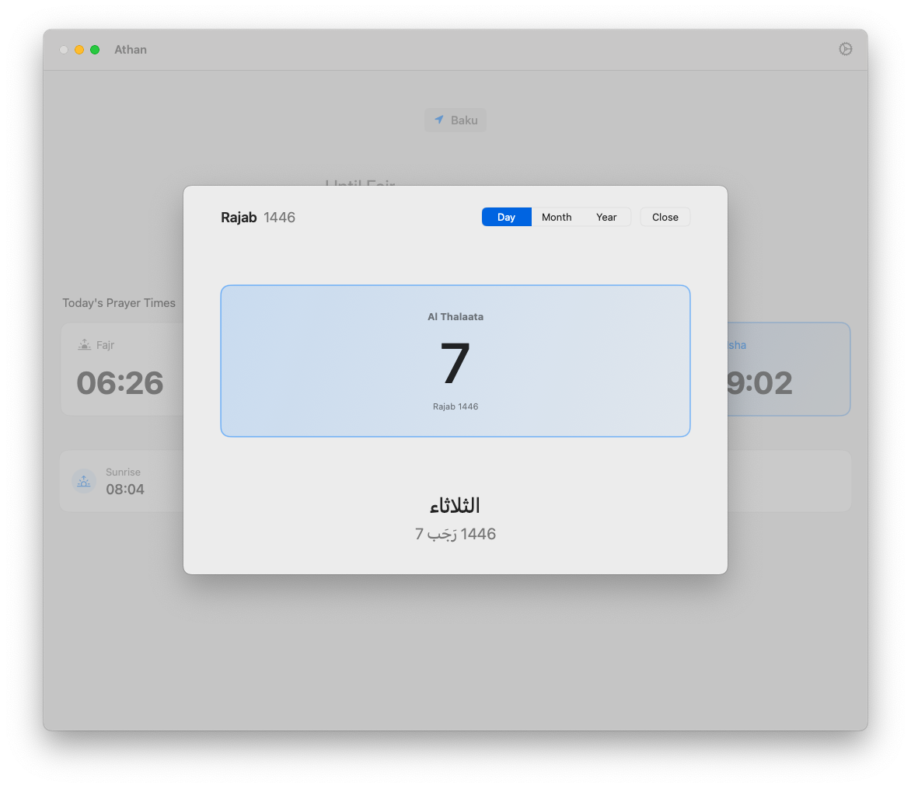
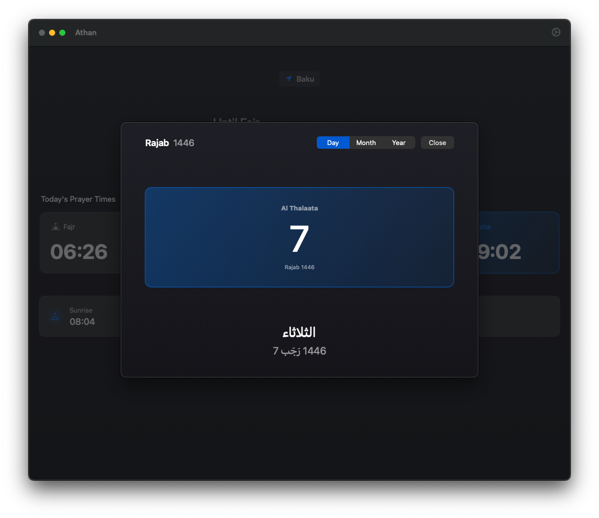
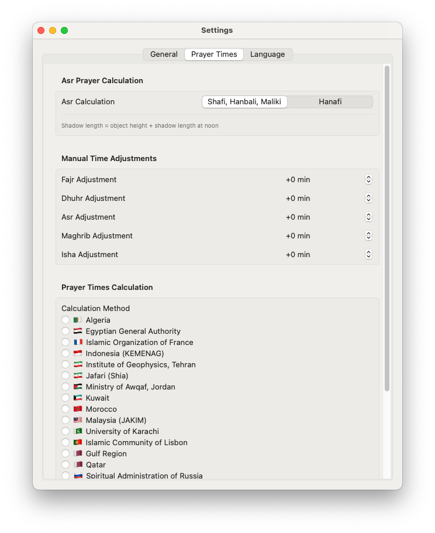
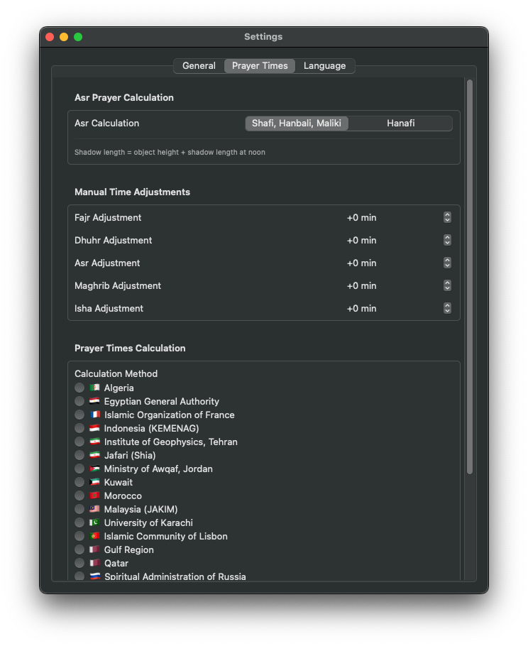

# Athan

Athan is a native macOS application that provides accurate Islamic prayer times with a beautiful interface and system-wide features.

## Features

### Core Features
- 🕌 Accurate prayer time calculations
- 🌍 Support for multiple calculation methods:
  - Muslim World League
  - Islamic Society of North America
  - Egyptian General Authority
  - Umm Al-Qura University, Makkah
  - And many more...
- 🔔 Native macOS notifications
- 🌙 Hijri calendar with beautiful visualization
- 🌓 Automatic dark mode support
- 🎨 Adapts to system accent color
- 🔄 Auto-updates prayer times based on location
- 🚀 Launch at login option

### Prayer Time Customization
- ⚙️ Adjustable Asr calculation methods:
  - Standard (Shafi, Maliki, Hanbali)
  - Hanafi
- ⏰ Manual time adjustments for each prayer
- 📍 Automatic location detection
- 🌐 Offline support with cached prayer times

### Language Support
- 🇺🇸 English
- 🇦🇿 Azerbaijani (Azərbaycanca)

## Screenshots

### Light Mode
<table>
  <tr>
    <td></td>
    <td></td>
  </tr>
</table>

### Dark Mode
<table>
  <tr>
    <td></td>
    <td></td>
  </tr>
</table>

### Hijri Calendar
<table>
  <tr>
    <td></td>
    <td></td>
  </tr>
</table>

### Settings & Customization
<table>
  <tr>
    <td></td>
    <td></td>
  </tr>
</table>

## System Requirements

- macOS 14.0 (Sonoma) or later
- Apple Silicon or Intel Mac
- Internet connection for initial setup
- Location Services for accurate times

## Installation

1. Download the latest version from [Releases](https://github.com/yourusername/Athan/releases)
2. Open the downloaded DMG file
3. Drag Athan.app to your Applications folder
4. Launch Athan from Applications or Spotlight

## Customization

### Accent Colors
Athan automatically adapts to your system's accent color:
- Changes prayer time highlights
- Updates calendar selections
- Modifies widget appearance
- Adjusts UI elements and icons

All accent colors from macOS System Settings are supported, providing a seamless integration with your personal setup.

## Third-Party APIs and Acknowledgments

- [Al Adhan API](https://aladhan.com/prayer-times-api) - Prayer times calculation
- [Apple WidgetKit](https://developer.apple.com/documentation/widgetkit) - Widget support
- [SwiftUI](https://developer.apple.com/xcode/swiftui/) - User interface framework

## Privacy

Athan respects your privacy:
- Location data is used only for prayer time calculations
- No personal data is collected or transmitted
- All calculations are performed locally
- Internet is used only for fetching prayer times and Hijri dates

## Support

For support, bug reports, or feature requests:
- Email: support@example.com
- Create an issue on GitHub

## Version History

See [CHANGELOG.md](CHANGELOG.md) for version history and changes.

---

*Note: Replace placeholder image paths (assets/...) with actual screenshots of your app.*
